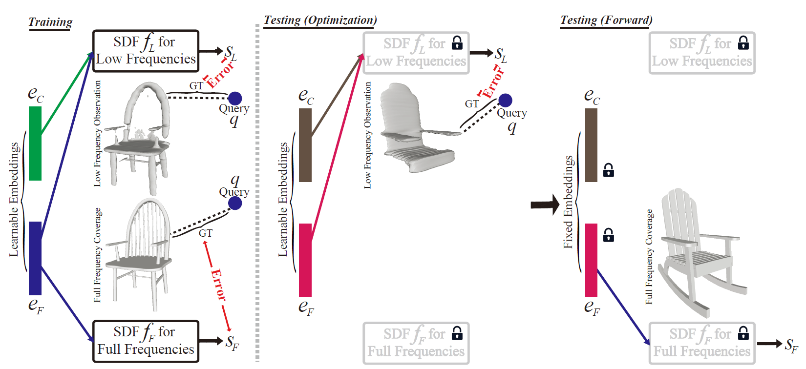

# Sharpening Neural Implicit Functions with Frequency Consolidation Priors (AAAI 2025)

### [Project](https://arxiv.org/pdf/2412.19720) | [paper (AAAI)](https://arxiv.org/pdf/2412.19720) 

## Citation

If you find this project useful in your research, please consider citing:

```
@inproceedings{chen2024FCP,
  author = {Chao Chen and Zhizhong Han and Yu-Shen Liu},
  title = {Sharpening Neural Implicit Functions with Frequency Consolidation Priors},
  booktitle = {Proceedings of the AAAI Conference on Artificial Intelligence},
  year = {2025},

```



## Setup

### Installation

## Dataset

## Training and Evaluation
